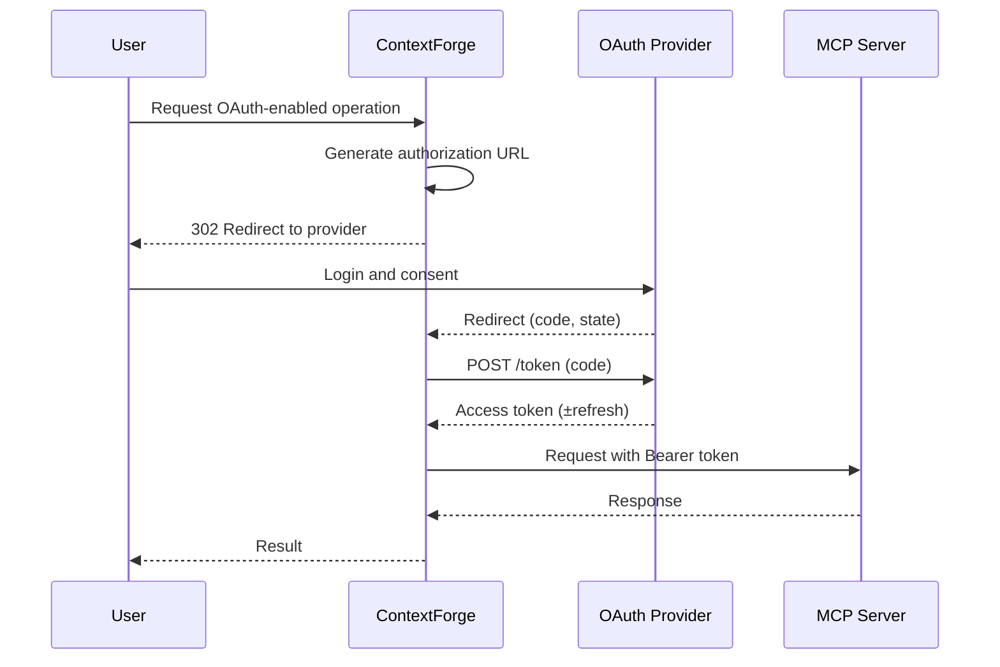

# OAuth 2.0 Integration

This guide explains how to configure and operate OAuth 2.0 authentication for ContextForge when connecting to MCP servers or downstream APIs on behalf of users or services.

Related design docs:

- Architecture: [oauth-design.md](../architecture/oauth-design.md)
- UI Flow: [oauth-authorization-code-ui-design.md](../architecture/oauth-authorization-code-ui-design.md)

---

## What You Get

- Client Credentials and Authorization Code flows
- Per-gateway OAuth configuration with encrypted client secrets
- Fresh tokens on demand (no caching by default)
- Optional token storage and refresh for user flows (per design)
- Admin UI support for configuring providers

!!! tip
    OAuth is configured per Gateway. Tools that route through a gateway configured for OAuth inherit the token behavior.

---

## Supported Flows

- Client Credentials (machine-to-machine)

  - Uses client ID/secret to fetch access tokens
  - Best for service integrations without user consent

- Authorization Code (user delegation)

  - Redirects the user to the provider for consent
  - Exchanges code for access token, with optional refresh tokens

See the flow details and security model in the architecture docs.

---

## Prerequisites

- An OAuth 2.0 provider (e.g., GitHub, Google, custom OIDC)
- A registered application with:

  - Client ID and Client Secret
  - Authorization URL and Token URL
  - Redirect URI pointing to the gateway callback (for Authorization Code)

---

## Environment Variables

```bash
# OAuth HTTP behavior
OAUTH_REQUEST_TIMEOUT=30      # Seconds
OAUTH_MAX_RETRIES=3           # Retries for transient failures

# Secret encryption for stored OAuth client secrets (and tokens if enabled)
AUTH_ENCRYPTION_SECRET=<strong-random-key>
```

!!! important
    Always run ContextForge over HTTPS when using OAuth. Never transmit client secrets or authorization codes over insecure channels.

---

## Configure a Gateway (Admin UI)

1. Open Admin UI → Gateways → New Gateway (or Edit).
2. Set Authentication type = OAuth.
3. Choose Grant Type:

   - client_credentials
   - authorization_code

4. Fill fields:

   - Client ID
   - Client Secret (stored encrypted at rest)
   - Token URL
   - Scopes (space-separated)
   - Audience (optional, for Atlassian, Auth0, and other non-RFC-8707 providers that use an `audience` request parameter)
   - Resource (optional, RFC 8707 audience indicator — see [OAuth Resource Configuration](oauth-resource-configuration.md))
   - Authorization URL and Redirect URI (required for Authorization Code)

5. Save.

Field mapping follows the architecture proposal and is used by the OAuth Manager service to request tokens.

!!! tip "Resource (Audience) Configuration"
    The **Resource** field controls the OAuth 2.0 `resource` parameter (RFC 8707) and token audience validation. In most cases you can leave it empty and let ContextForge auto-derive (from the gateway URL origin) and auto-learn (from the first successful token) the correct value. See [OAuth Resource Configuration](oauth-resource-configuration.md) for when to set it explicitly and how to force a re-learn.

---

## Configure a Gateway (JSON/API)

Example OAuth-enabled gateway record:

```json
{
  "name": "GitHub MCP",
  "url": "https://github-mcp.example.com/sse",
  "auth_type": "oauth",
  "oauth_config": {
    "grant_type": "authorization_code",
    "client_id": "your_github_app_id",
    "client_secret": "your_github_app_secret",
    "authorization_url": "https://github.com/login/oauth/authorize",
    "token_url": "https://github.com/login/oauth/access_token",
    "redirect_uri": "https://gateway.example.com/oauth/callback",
    "scopes": ["repo", "read:user"]
  }
}
```

For Client Credentials, omit `authorization_url` and `redirect_uri` and set `grant_type` to `client_credentials`.

### Audience Parameter

Some OAuth providers (Atlassian, Auth0, etc.) require an `audience` parameter instead of or in addition to the RFC 8707 `resource` parameter:

```json
{
  "name": "Atlassian MCP",
  "url": "https://atlassian-mcp.example.com/sse",
  "auth_type": "oauth",
  "oauth_config": {
    "grant_type": "authorization_code",
    "client_id": "your_atlassian_app_id",
    "client_secret": "your_atlassian_app_secret",
    "authorization_url": "https://auth.atlassian.com/authorize",
    "token_url": "https://auth.atlassian.com/oauth/token",
    "redirect_uri": "https://gateway.example.com/oauth/callback",
    "audience": "api.atlassian.com",
    "scopes": ["read:jira-work", "write:jira-work"]
  }
}
```

The `audience` parameter:
- Is included in both authorization and token exchange requests
- Can coexist with `resource` parameter for providers that accept both
- When set without `resource`, the RFC 8707 `resource` parameter is automatically omitted

### Resource Parameter (RFC 8707) — per-user audience learning, origin fallback, advisory validation

!!! info "See also"
    For a task-oriented guide (provider patterns, multi-resource configs, forcing a re-learn), see [OAuth Resource Configuration](oauth-resource-configuration.md). This section summarises the behaviour and links back to the implementation details.

The gateway resolves the expected token audience via a three-level precedence, with
per-user isolation on the learned tier:

1. **Explicit `oauth_config.resource`** — admin sets it (single URI or list) via the Admin
   UI "Resource (Audience)" field or via the API. Authoritative and blocking. Global to
   the gateway.
2. **Per-user `OAuthToken.learned_aud`** — on each user's OAuth callback, the gateway
   decodes the access token's `aud` and `iss` claims (best-effort, unverified) and stores
   them on that user's own token row. Subsequent validation for THAT USER checks their
   token against their own learned value. Authoritative and blocking for that user only.
3. **Auto-derived gateway URL origin** — if neither of the above applies, the gateway
   uses `scheme://netloc` from the gateway URL as an advisory fallback. Most providers
   (Salesforce, Azure AD, Okta) issue origin-level audiences, so this maximises
   first-authentication success.

**Why per-user (and not per-gateway)?** The earlier design stored learned audience on
shared `gateway.oauth_config.resource`. That created two problems: (a) a single gateway
serving multiple IdP tenants with per-tenant `aud` values would have its `resource` pinned
by whichever user authenticated first, locking out other tenants; and (b) the OAuth
callback path only enforces gateway access, not `gateways.update`, so callback-driven
writes to shared config let users without the update permission mutate global state.
Per-user storage eliminates both.

**Outbound `resource` parameter.** The RFC 8707 `resource` value sent to the IdP is still
sourced from `oauth_config.resource` (or the origin fallback if unset). It is not derived
from any user's learned value — outbound requests are the same regardless of who
initiated them.

**Advisory vs. blocking audience validation.**

| Expected audience source | Mismatch severity | Behavior |
|---|---|---|
| Explicitly configured `oauth_config.resource` | Blocking | `GatewayConnectionError` raised, token not forwarded |
| Per-user `OAuthToken.learned_aud` | Blocking (for this user) | `GatewayConnectionError` raised, token not forwarded |
| Auto-derived gateway URL origin (fallback) | Advisory (default) | Warning logged, token forwarded — upstream MCP server is the authority |

The advisory fallback only applies to users with no learned value (first authentication)
and no admin-configured resource. If you cannot rely on the upstream MCP server to
validate `aud`, enable strict mode to make even the fallback authoritative:

```bash
# .env
OAUTH_REQUIRE_CONFIGURED_RESOURCE=true
```

**Triggering re-learning.**

- *For one user*: they re-authenticate. The next OAuth callback overwrites their
  `OAuthToken.learned_aud` with the current audience. No admin action needed.
- *For admin-configured `oauth_config.resource`*: edit the gateway in the Admin UI and
  blank the Resource field (or PUT `{"oauth_config": {"resource": null}}` via API).

---

## Redirect URI and Callback

- Default callback path: `/oauth/callback`
- Your provider must whitelist the full redirect URI, e.g. `https://gateway.example.com/oauth/callback`
- The gateway handles exchanging the authorization code for an access token and applies it as `Authorization: Bearer <token>` when contacting the MCP server

Sequence (Authorization Code):



---

## Token Storage and Refresh

OAuth tokens are stored per gateway and user for the Authorization Code flow to ensure proper security isolation:

- **User-Scoped Tokens**: OAuth tokens are scoped per ContextForge user (using app_user_email field) to prevent token sharing between users
- Store tokens per gateway + user combination with unique constraints
- Auto-refresh using refresh tokens when near expiry
- Encrypt tokens at rest using `AUTH_ENCRYPTION_SECRET`
- Foreign key relationships ensure token cleanup when users are deleted

!!! important "Security Enhancement"
    OAuth tokens are now user-scoped to prevent token sharing between users. Each Authorization Code flow token is tied to the specific ContextForge user who authorized it, providing better security isolation.

---

## Provider Examples

### GitHub (Authorization Code)

- Authorization URL: `https://github.com/login/oauth/authorize`
- Token URL: `https://github.com/login/oauth/access_token`
- Scopes: `repo read:user`
- Redirect URI: `https://<your-domain>/oauth/callback`

### Atlassian (Authorization Code with Audience)

- Authorization URL: `https://auth.atlassian.com/authorize`
- Token URL: `https://auth.atlassian.com/oauth/token`
- Audience: `api.atlassian.com`
- Scopes: `read:jira-work write:jira-work read:confluence-content.all`
- Redirect URI: `https://<your-domain>/oauth/callback`

### Auth0 (Client Credentials with Audience)

- Token URL: `https://<your-tenant>.auth0.com/oauth/token`
- Audience: `https://your-api.example.com`
- Scopes: provider-specific
- No redirect required

### Generic OIDC (Client Credentials)

- Token URL: `https://idp.example.com/oauth2/token`
- Scopes: provider-specific
- No redirect required

---

## Security Recommendations

- Use least-privilege scopes
- Run behind HTTPS only (including callback)
- Rotate client secrets and avoid plaintext storage
- Restrict who can create/modify OAuth-configured gateways
- Monitor token fetch errors and rate limits from providers

See also: [securing.md](./securing.md) for general hardening guidance and [proxy.md](./proxy.md) for fronting the gateway with an auth proxy.

---

## Troubleshooting

Common issues and quick fixes:

- **401 from MCP after OAuth**: Verify scopes and that token is attached as `Authorization: Bearer` by the gateway
- **Provider denies callback**: Check exact Redirect URI match and HTTPS
- **Invalid client**: Confirm Client ID/Secret and application registration
- **State mismatch / "Invalid or expired state parameter"**: See the detailed [OAuth Troubleshooting Guide](oauth-troubleshooting.md)
- **Timeouts**: Increase `OAUTH_REQUEST_TIMEOUT` or investigate provider availability

!!! tip "Detailed Troubleshooting"
    For comprehensive debugging steps, error message explanations, and state storage configuration, see the [OAuth Troubleshooting Guide](oauth-troubleshooting.md).

---

## PKCE Support

ContextForge implements **PKCE (Proof Key for Code Exchange)** as defined in [RFC 7636](https://tools.ietf.org/html/rfc7636) for all Authorization Code flows. This provides enhanced security, especially for:

- Public clients (mobile apps, SPAs, desktop apps)
- Environments where client secrets cannot be securely stored
- Protection against authorization code interception attacks

**How it works:**

1. Gateway generates a random `code_verifier` (43-128 characters)
2. Computes `code_challenge` = BASE64URL(SHA256(code_verifier))
3. Sends `code_challenge` and `code_challenge_method=S256` in authorization request
4. Stores `code_verifier` in OAuth state (encrypted at rest)
5. Includes `code_verifier` when exchanging authorization code for token

PKCE is **automatically enabled** for all Authorization Code flows - no configuration needed.

---

## FAQ

- **Can I use PKCE?** Yes! PKCE is automatically enabled for all Authorization Code flows (RFC 7636).
- **Can I configure per-tool OAuth?** Roadmap considers multiple OAuth configs per tool; current design is per-gateway.
- **Do you cache tokens?** Default is no caching; tokens are fetched per operation. Optional storage/refresh is available for Authorization Code flows.
